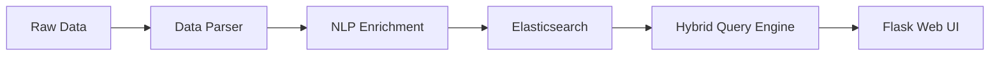

# Smart IR System: Spatio-Temporal Hybrid Retrieval

A high-performance, intelligent document retrieval system built on the **Reuters-21578** dataset. This project integrates traditional Lexical search with modern Semantic (Vector) search, enhanced by AI-driven temporal and geographic extraction.


## 🚀 Key Features

*   **Hybrid Search Engine**: Combines **BM25** (Elasticsearch default) for keyword precision and **kNN** (Vector Search) for semantic understanding.
*   **AI Enrichment Pipeline**:
    *   **Temporal Extraction**: Uses spaCy and `dateparser` to extract and normalize dates from raw text.
    *   **Geographic Extraction**: identifies locations and uses geocoding (Nominatim) to generate `geo_point` coordinates.
*   **Dynamic Search Balance**: A UI slider to adjust the weight between Lexical (Exact) and Semantic (Meaning) results in real-time.
*   **Score Normalization**: Ensures all search results are normalized to a 0.0 - 1.0 range for better interpretability.
*   **Advanced Analytics**: Custom dashboard built using Elasticsearch aggregations to visualize temporal distribution and geographic hotspots.
*   **Interactive Map**: Visual representation of document locations extracted through the pipeline.

## 🏗️ Architecture

The system follows a 4-layered pipeline:
1.  **Ingestion**: Raw SGML files are parsed into structured JSON.
2.  **Enrichment**: NLP models extract dates, locations, and generate semantic vectors (384-dimensions).
3.  **Indexing**: Data is stored in Elasticsearch with custom mappings for hybrid retrieval.
4.  **Retrieval**: The Query Engine performs multi-stage ranking with spatiotemporal filters.



## 🛠️ Technology Stack

*   **Backend**: Python 3.12, Flask
*   **Search Engine**: Elasticsearch 8.x
*   **AI Models**: 
    *   `all-MiniLM-L6-v2` (Sentence Transformers)
    *   `en_core_web_sm` (spaCy)
*   **Frontend**: Vanilla HTML5, CSS3, JavaScript (D3.js/Leaflet for maps)

## 👥 Team & Role Division

This project was developed by a team of 4, with specific implementation pillars:

1.  **Student 1 (Data & Indexing)**: SGML Parsing, Data Cleaning, and Elasticsearch Mapping design.
2.  **Student 2 (Search & Scoring)**: Hybrid Retrieval logic, Ranking algorithms, and Score Normalization.
3.  **Student 3 (AI & Extraction)**: Vector Embeddings integration, NER for Temporal and Geo extraction.
4.  **Student 4 (Frontend & Analytics)**: UI/UX Design, Flask API integration, and Aggregation-based Dashboards.

## 📥 Installation & Setup

1.  **Clone the repository**:
    ```bash
    git clone https://github.com/your-repo/smart-ir-system.git
    cd smart-ir-system
    ```

2.  **Set up Virtual Environment**:
    ```bash
    python -m venv venv_py312
    .\venv_py312\Scripts\activate
    pip install -r requirements.txt
    ```

3.  **Start Elasticsearch**: Ensure Elasticsearch 8.x is running on `http://localhost:9200`.

4.  **Index Data**:
    ```bash
    python index_reuters_root.py
    ```

5.  **Run the application**:
    ```bash
    python main.py
    ```

## 📊 Evaluation & Testing

The project includes a comprehensive test suite (`run_test_suite.py`) covering 10 distinct scenarios:
*   Lexical hits in Title vs Body.
*   Semantic concepts (e.g., searching for "Debt" without using the word).
*   Spatiotemporal filtering accuracy.
*   Score normalization limits (0-1).

---
*Developed for the Information Retrieval Course.*
